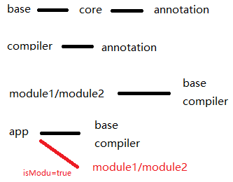

# ARouter_Demo

手写ARouter路由框架

- 包结构： 
```
 app                - app
 base               - androidLib
 lib_annotation     - javaLib
 lib_compiler       - javaLib
 lib_core           - androidLib
 module1            - androidLib or app
 module2            - androidLib or app
 ```
-  依赖关系



-  原理

1. 利用auto-service注册注解生成器，使用write并编译时自动生成，实现了路由注册的类，并在类种添加注册ARouter的key，value的代码
2. 在application初始化的时候init，根据
   context->getPackageManager->dexFile->根据包名过虑class，找到后，判断是否是其实现类，再反射获取对象，调用实现方法
   
- 拓展
1. 注入编译时修改替换反射
2. 路由传参，另一个页面注解获取参数值：
   传的参数存储在map中，在生成的另一个文件中获取赋值获取参数值的类，并在注册得时候调用，类似于:
  
```
A ---> :

@Extra
String msg;
    
B ---> : 
   
public class Module1MainActivity_Extra implements IExtra {
  @Override
  public void loadExtra(Object target) {
    Module1MainActivity t = (Module1MainActivity)target;
    t.msg = t.getIntent().getStringExtra("msg");
  }
}
```


